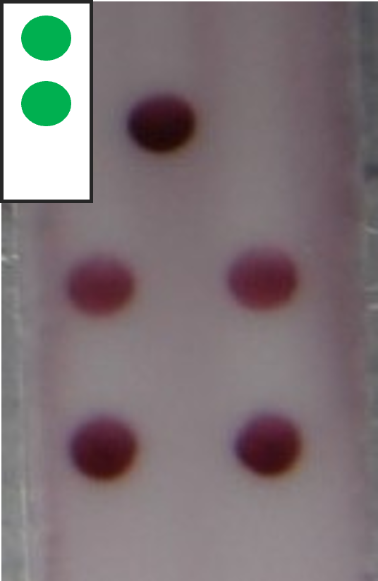
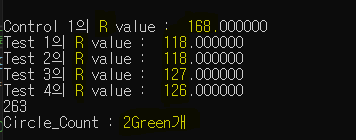

# 이 프로젝트를 사용하는 방법

- 해당 프로젝트는 C++ 언어를 기반으로 한 openCV 프로젝트입니다.

- 실행 시, 코드 내에서 __프로젝트 내의 test 폴더에 있는 사진을 입력__하여 

  ### 주요 기능

  - 1.  5개 검출대상 원의 Red value 값을 console에 출력합니다. 
    2.  카트리지 영역 내의 원의 개수, 색깔을 detect 하여 카트리지 타입을 console에 출력합니다.

- 입력 사진의 예시는 다음과 같습니다.

  

1. 주요 기능의 1은 입력 사진의 전체 영역을 대상으로 원의 Red Value를 출력합니다.
2. 주요 기능의 2는 입력 사진의 왼쪽 상단의 카트리지 영역을 대상으로 원의 색깔과 개수를 출력합니다.
3. 1과 2에서 입력되는 영역은 __고정 영역__ 이며, 프로그램 소스코드 내에서 변경 가능합니다.
   1.  소스코드 내의 "x,y 좌표 인쇄 함수" 를 활용하여, 사진이 변경되더라도 바뀐 사진의 x,y 좌표를 쉽게 검출할 수 있습니다.
   2. 바뀐 사진에서 검출한 새로운 x,y 좌표는 사용자가 직접 소스코드 내에서 변경하여야 적용 가능합니다.

###  실행 결과

- 사진 입력 및 원 검출이 성공적으로 수행되면, 다음과 같은 결과가 콘솔에 나타납니다.

  

  

##  프로젝트 및 소스코드 다운로드 방법

- 프로젝트에 대한 자세한 설명 및 활용 방법은 다음의 노션을 참고하여 주십시오.

  [CircleDetector (notion.so)](https://www.notion.so/_CircleDetector-88254fbf9ec74941b57f87da45a834a5)

- 해당 프로젝트는 이바이오젠이 개발하였으며, 자세한 내용은 외부에 공개하지 않습니다.